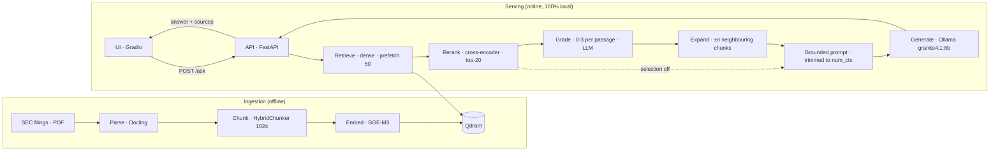

# FinQA Engine — Production-ready agentic RAG for financial document Q&A

[](https://github.com/ahmedgh970/finqa-engine/actions/workflows/ci.yml) [](https://www.python.org/) [](LICENSE) [](https://github.com/astral-sh/ruff) [](https://github.com/astral-sh/uv) [](https://github.com/patronus-ai/financebench) [](https://qdrant.tech/)   [](https://github.com/docling-project/docling) <br>
[](https://github.com/langchain-ai/langgraph) [](https://github.com/langchain-ai/langchain) [](https://ollama.com/) [](https://fastapi.tiangolo.com/)

> End-to-end RAG & Agentic RAG benchmark on [FinanceBench](https://github.com/patronus-ai/financebench); 150 financial QA pairs, 368 SEC filings (10-K/10-Q).
> From naive retrieval to multi-agent system, every improvement is justified by a number.

---

## Overview

FinanceBench shows that state-of-the-art RAG systems fail on ~80% of financial questions (GPT-4-Turbo, 2023). This project builds a rigorous benchmark to measure and systematically improve that number using open-source LLMs and modern RAG techniques.

**What this repo demonstrates:**
- Reproducible evaluation pipeline (retrieval metrics + LLM judge + Ragas)
- Progression: naive RAG → hybrid search + reranking → advanced RAG → agentic RAG → multi-agent
- Multi-LLM open-source benchmark (quality / latency / cost)
- Production patterns: observability (Phoenix), CI with eval regression, FastAPI serving

---

## Architecture



The index is built once offline; every question is served online by retrieving
from Qdrant, reranking with a cross-encoder, then generating a grounded answer
with a local Ollama model. Between the two, grading and expansion are switches:
the grader scores each passage and keeps what holds part of the answer, the
expansion reads each survivor with the chunks that surround it in its filing, so
a statement cut across chunks reaches the prompt whole. With both off the graph
reduces to retrieve → rerank → generate, the baseline every row is measured
against. See [ADR 0001](docs/adr/0001-retrieval-strategy.md) (retrieval),
[ADR 0002](docs/adr/0002-generation-model.md) (generation) and
[ADR 0004](docs/adr/0004-crag-workflow-evidence-grid.md) (workflow rows).

---

## Results

### Retrieval

Retrieval quality on the 150 FinanceBench QA. Doc-scoped means the search is
restricted to the question's source filing:

| CONFIG | doc_scoped | prefetch | chunks | recall@5 | recall@10 | recall@20 | MRR | nDCG@10 | nDCG@20 |
|---|---|---|---|---|---|---|---|---|---|
| Dense | no | — | 512 | 0.230 | 0.297 | — | 0.182 | 0.205 | — |
| Dense | yes | — | 512 | 0.402 | 0.552 | — | 0.338 | 0.377 | — |
| Dense + reranker | yes | 50 | 512 | 0.549 | 0.649 | 0.744 | 0.438 | 0.473 | 0.499 |
| Dense + reranker | yes | 50 | 256 | 0.513 | 0.623 | 0.738 | 0.442 | 0.467 | 0.498 |
| Dense + reranker | yes | 50 | 1024 | 0.550 | 0.654 | 0.751 | 0.451 | 0.478 | 0.504 |

The reranker is a `bge-reranker-v2-m3` cross-encoder re-scoring the dense shortlist
(prefetch). The two dense rows and the 512 reranker row are the strategy ablation of
[ADR 0001](docs/adr/0001-retrieval-strategy.md) (BM25 and hybrid fusion there too),
the dense rows measured at depth 10; the three reranker rows vary only the chunk budget
and are measured at depth 20 (MRR included, hence 0.438 rather than ADR 0001's 0.433
for the 512 row). The 1024 row is what every generation row below is served:
materialised once at depth 20, then replayed identically by each of them. Recall still
gains about +0.10 from depth 10 to 20, hence 20 passages then grading.

Recall is defined at the page level: a passage counts as soon as it lands on a gold
page, whether or not it holds the figures the question needs. Measured directly, the
share of FinanceBench's evidence text found in the 20 retrieved passages tells a
different story:

| chunks | k | tokens / prompt | evidence words | evidence numbers | questions with every evidence number |
|---|---|---|---|---|---|
| 256 | 20 | 4,300 | 0.726 | 0.628 | 29% |
| 512 | 20 | 7,900 | 0.798 | 0.705 | 38% |
| 1024 | 20 | 14,400 | 0.872 | 0.803 | 48% |

Recall@20 is flat across chunk sizes, the evidence actually retrieved is not: 20
passages of 256 tokens hold 63% of the evidence numbers, 20 of 1024 hold 80%. Per token
the sizes are on par (256 at k20 matches 512 at k10, 512 at k20 matches 1024 at k10),
so larger chunks win at a fixed depth only by carrying more text. An evidence averages
443 tokens, beyond a single 256-token chunk for 63% of the questions. The last column is
strict: an evidence is often a whole statement page of which the answer uses two
figures.

#### What fits a 12K window

A context window is VRAM: it sizes the KV cache, so it is the budget to spend, not a
number to raise. The rows below all run at `num_ctx` 12288 and differ by what they put
in it — the chunk size, the grade a passage must reach to be kept, and how many
neighbouring chunks each survivor is read with. *Trimmed* counts the questions whose
context did not fit and was cut back; *complete* is the share of questions holding
every figure their evidence is built from.

| chunks | grade ≥ | window | passages read | tokens | trimmed | figures | complete |
|---|---|---|---|---|---|---|---|
| 1024 | — | — | 10.2 | 7593 | 147 | 0.648 | 43.9% |
| 1024 | 2 | — | 5.6 | 4048 | 10 | 0.656 | 44.6% |
| **1024** | **2** | **±1** | 11.4 | **6314** | 64 | **0.722** | **56.8%** |
| 1024 | 2 | ±2 | 13.9 | 7236 | 102 | 0.707 | 56.1% |
| 1024 | 3 | ±1 | 9.7 | 5444 | 27 | 0.684 | 52.5% |
| 512 | — | ±1 | 22.5 | 7694 | 145 | 0.661 | 47.5% |
| 256 | — | — | 19.6 | 4261 | 0 | 0.568 | 36.0% |
| 256 | 2 | — | 5.9 | 1285 | 0 | 0.414 | 23.0% |
| 256 | 2 | ±4 | 30.1 | 5884 | 42 | 0.661 | 52.5% |

**Grading and expansion are one mechanism, not two.** Alone, the grader keeps 5.6
passages out of 20 and reads 4048 tokens — a third of the window, and no more evidence
than reading all twenty. Alone, expansion has nothing to select: every passage becomes
an anchor, the window saturates and 147 of the 150 questions are cut back. Together
they hold 56.8% of the questions complete in 6314 tokens, which is what `reranked(dense)`
top-20 needs a 24K window to reach.

**Reading beats retrieving more.** A grade of 2 — the passage holds part of what the
answer is built from — is the right bar: at 3 the surviving anchors are too few and
their neighbourhoods miss the rest of the statement. And each corpus needs the window
its chunks imply: ±1 on 1024-token chunks, ±4 on 256-token ones, for a context four
times more fragmented and 4 points less complete.

These are measures of what reaches the prompt, not of answers. The generation rows
below show the two do not always move together.

### Generation

End-to-end generation quality on the 150 QA (corpus `docling_hybrid_1024_bge-m3`,
`reranked(dense)` with a prefetch of 50, doc-scoped), best depth per model. Every
answer is read in full and compared with the gold on two independent axes:

- **correct**: the final value or conclusion agrees with the gold answer;
- **grounded**: the reasoning behind it rests on the retrieved passages, not on
  invented figures or unjustified assumptions;
- **equivalent** = correct **and** grounded, the headline metric;
- **Prometheus**: mean 1–5 score from the open Prometheus-2 judge on its verbatim
  Absolute Grading rubric, run locally. It ranks our ten rows almost exactly as
  `equivalent` does (Spearman ρ = 0.96, against 0.93 on the four models of
  [ADR 0003](docs/adr/0003-prometheus-judge.md)); read it as a ranking, not as an
  absolute grade.

Our rows are judged by Claude on the correct / grounded protocol. The FinanceBench
rows are the answers published with the benchmark for its `singleStore` setting (one
Chroma vector store per filing with OpenAI `text-embedding-ada-002` embeddings, the
closest to our doc-scoped retrieval; generated in November 2023 at temperature
0.01). Their `correct` is the benchmark's human label after an answer-by-answer
audit: 93% of the published labels were kept; the others were corrected where they
disagreed with the benchmark's own gold answer, its rounding or its refusal
definition. Those runs publish no retrieved passages, so `grounded` and
`equivalent` cannot be measured for them. They differ
from ours in model, retrieval and grader, so read them as a reference point rather
than a controlled comparison. Full table, depth ablation and analysis in
[ADR 0002](docs/adr/0002-generation-model.md).

| Model | Params | Setting | equivalent | correct | grounded | Prometheus (1–5) |
|---|---|---|---:|---:|---:|---:|
| **granite4.1:8b** | 8.8B | k20 | **65.3** | **65.3** | 87.3 | **4.15** |
| granite4.1:8b + grader | 8.8B | k20 | 61.3 | 62.7 | 85.3 | 4.10 |
| qwen3.5:4b | 4.7B | k20 | 60.0 | 60.0 | **99.3** | 4.07 |
| qwen3.5:9b | 9.7B | k20 | 58.0 | 58.7 | **99.3** | 3.70 |
| llama3.1:8b | 8.0B | k20 | 50.7 | 50.7 | 92.7 | 3.17 |
| mistral-nemo | 12.2B | k5 | 47.3 | 48.7 | 77.3 | 3.33 |
| mistral:7b | 7.2B | k20 | 41.3 | 41.3 | 92.0 | 3.27 |
| granite4.1:3b | 3.4B | k5 | 40.0 | 42.7 | 74.7 | 3.10 |
| command-r7b | 8.0B | k5 | 38.7 | 40.0 | 68.7 | 2.95 |
| llama3.2:3b | 3.2B | k10 | 28.7 | 28.7 | 89.3 | 2.49 |
| *FinanceBench* gpt-4-1106-preview (GPT-4 Turbo) | undisclosed | singleStore | — | 48.0 | — | 3.39 |
| *FinanceBench* gpt-4 | undisclosed | singleStore | — | 41.3 | — | 2.71 |
| *FinanceBench* llama-2-70b-chat | 70B | singleStore | — | 37.3 | — | 3.75 |

The grader row is the advanced workflow's per-passage grading (0–3, floor of 3
passages) on the same replayed top-20. It was generated at `num_ctx` 12288 while the
plain k20 row used 30720, so the gap between the two mixes the grader's effect with
the context window's; [ADR 0004](docs/adr/0004-crag-workflow-evidence-grid.md)
compares them at equal window. It costs about 20 LLM calls per question instead of
one.

Prometheus scores a refusal 1, so it reads caution as failure. On our ten rows it
agrees with `correct` at ρ = 0.94; add the three published rows and the agreement over
the thirteen falls to 0.74, because that is where refusals concentrate.
llama-2-70b-chat refuses 7 times and answers wrongly 81, yet outranks both GPT-4 rows
on Prometheus (3.75 against 3.39 and 2.71) while being correct less often (37.3 against
48.0 and 41.3); those two refuse 58 and 71 times out of 150.
Compare Prometheus within a family of rows that refuse at a similar rate, not across
the whole table.

Key finding: **useful retrieval depth scales with model capability** — the
k10→k20 step only helps the strongest models (flat for the 3B tier). See ADR 0002.

### Advanced RAG workflow

The deterministic LangGraph workflow (`src/workflow/`) replays the same
`reranked(dense)` top-20 passages for every row and generates with `granite4.1:8b`.
A judge only reads each answer (correct? refused?); the code then
checks whether the gold evidence page actually reached the prompt, and the two
together place the answer in one of five outcomes:

- **Good job**: correct, with the gold evidence in the prompt.
- **Unverified**: correct but unverified in the context — the gold evidence never
  reached the prompt, so the answer may rest on another passage (an MD&A table
  repeating the statement, say) or on luck.
- **Need help**: wrong although the gold evidence was in the prompt (generation failure).
- **Hallucinating**: wrong, and the gold evidence never reached the prompt.
- **Don't know**: refusal.

The verdicts behind this table are Claude's. `make judge` reproduces the grid with a
local judge, `qwen3.5:9b`, validated against those verdicts on runs held out from
prompt tuning (kappa 0.81 on correct): the two judges agree on the ranking of the
best row, but a gap of fewer than about 5 good jobs between two rows is within their
disagreement and should not be read as a difference. Full grid, per-question
transitions, failure analysis and the judge validation are in
[ADR 0004](docs/adr/0004-crag-workflow-evidence-grid.md).

| Workflow row | Good job | Unverified | Hallucinating | Need help | Don't know | Evidence in prompt | Latency / Q | LLM calls / Q |
|---|---|---|---|---|---|---|---|---|
| `num_ctx` 12288 (~10 passages) | 73 | 13 | 25 | 16 | 23 | 93 | 107 s | 1 |
| `num_ctx` 12288 (grading 0–3 + floor of 3) | 74 | 14 | 26 | 14 | 22 | 92 | 161 s | 20.9 |
| **`num_ctx` 24576 (~20 passages)** | **79** | 13 | **17** | 22 | **19** | **105** | 187 s | 1 |

Key finding: the larger window is the best row, but only 4 of its 16 gains over
the 12K window come from newly retrieved evidence. The rest reflect how
sensitive generation is to the surrounding context. With more evidence in
context, failures shift from *hallucinating* to *need help*: the generator,
not the retrieval, is now the bottleneck on those questions.

---

## Local LLM lineup

The generation stage runs open-weight LLMs locally via Ollama on a single 8GB
GPU (with automatic GPU/CPU layer offload for models that don't fully fit). The
lineup is capped at **~14B params** — the largest that keeps the majority of
layers on GPU; beyond that, inference is CPU-bound and impractical for the
150 QA grid. Specs below were measured on the actual hardware:


| Model | Params | Context | Disk | VRAM @8K ctx | Angle |
|---|---|---|---|---|---|
| `llama3.2:3b` | 3.2B | 128K | 2.0 GB | 3.1 GB · 100% GPU | Meta — small, fast floor |
| `granite4.1:3b` | 3.4B | 128K | 2.1 GB | 2.9 GB · 100% GPU | IBM (newest) — dense 3B |
| `qwen3.5:4b` | 4.7B | 256K | 3.4 GB | 3.4 GB · 100% GPU | Alibaba (newest) — small |
| `mistral:7b` | 7.2B | 32K | 4.4 GB | 5.6 GB · 100% GPU | Mistral |
| `command-r7b` | 8.0B | **8K** | 5.1 GB | 5.6 GB · 100% GPU | Cohere — RAG-native |
| `llama3.1:8b` | 8.0B | 128K | 4.9 GB | 5.8 GB · 100% GPU | Meta — baseline |
| `granite4.1:8b` | 8.8B | 128K | 5.3 GB | 6.6 GB · 100% GPU | IBM (newest) — enterprise/finance |
| `qwen3.5:9b` | 9.7B | 256K | 6.6 GB | 5.8 GB · 100% GPU | Alibaba (newest) |
| `mistral-nemo` | 12.2B | 1M | 7.1 GB | 8.6 GB · 80% GPU | Mistral — mid tier |

*Context = model's max window. Disk = on-disk size. VRAM @8K = loaded footprint
at `num_ctx=8192`, total size and GPU share.*

**Retrieval depth (k) and cached context.** Each model is benchmarked at
`k = 5 / 10 / 20` retrieved chunks. Every k fixes the `num_ctx` (the KV-cache
context reserved per request) to the true max real-prompt token count across
all 150 questions at that depth — measured with `mistral:7b`, the lineup's most
expensive tokenizer — plus a 1024-token output budget:

| k | `num_ctx` (cached context) |
|---|---|
| 5 | 10240 |
| 10 | 18432 |
| 20 | 30720 |

Two exceptions to the full k sweep: **`command-r7b`** runs at `k=5` only — its
8K context can't hold the larger budgets (and even at k5 it runs at its own 8K
max rather than 10240). **`mistral-nemo`** is also `k=5` only — its context is
large enough, but its partial CPU offload (80% GPU) makes generation at k=10/20
too slow to be practical. All other models cover the full `k = 5 / 10 / 20`.

---

## Quickstart

```bash
# 1. Start services (Qdrant + Phoenix)
docker compose up -d

# 2. Install dependencies
make install-all

# 3. Build the corpus: parse -> chunk -> index into Qdrant
make parse CONFIG=configs/parse/docling.yaml
make chunk CONFIG=configs/chunk/docling_hybrid_512.yaml
make index CONFIG=configs/index/docling_hybrid_512.yaml

# 4. Evaluate retrieval quality
make eval-retrieval CONFIG=configs/evaluation/retrieval/chunks512_reranked_dense.yaml

# 5. Generate answers with the RAG pipeline (local Ollama, no quota)
make answer CONFIG=configs/rag/naive_reranked_dense_1024_k10_ollama.yaml                            # all 150 QA
make answer CONFIG=configs/rag/naive_reranked_dense_1024_k10_ollama.yaml ID=financebench_id_03029  # one QA

# 6. Score the answers (the answers file picked with ANSWERS=, the judge protocol with PROTOCOL=)
make judge ANSWERS=data/processed/answers/<run>.jsonl                          # outcome grid (PROTOCOL=grid, default)
make judge ANSWERS=data/processed/answers/<run>.jsonl MODEL=ollama_chat/qwen3.5:9b  # another judge model
make judge PROTOCOL=correct_grounded ANSWERS=data/processed/answers/<run>.jsonl     # correct / grounded
make judge PROTOCOL=prometheus ANSWERS='data/processed/answers/*_k20.jsonl'    # Prometheus-2, 1-5 rubric
make ragas ANSWERS=data/processed/answers/<run>.jsonl LIMIT=50                 # faithfulness, answer relevancy
```

---

## Run the demo locally

Everything is local — Qdrant in Docker, the API / UI / LLM on the host (GPU).
No external inference provider.

```bash
# vector DB (Docker) + the served generator
docker compose up -d qdrant
ollama pull granite4.1:8b

# serve the API + the UI (two terminals)
make serve        # FastAPI on :8000  — GET /health, POST /ask, GET /options
make demo         # Gradio UI on :7860  -> open http://localhost:7860

# or query the API directly
curl -s -X POST localhost:8000/ask -H 'Content-Type: application/json' \
  -d '{"question":"What was 3M FY2018 capital expenditure?","doc_id":"3M_2018_10K"}'
```

The LLM, retrieval depth `k` and Qdrant collection are picked in the UI (or per
request in `/ask`); the default is `granite4.1:8b` at k10 (ADR 0002), set by the
`RAG_CONFIG` env var. Retrieval models run on the host GPU; on an 8 GB card the
generator falls back to CPU when both compete for VRAM.

<!-- Demo GIF — record the UI (see docs/checklists) and uncomment:

-->

---

## Project Structure

```
finqa-engine/
├── README.md
├── docs/                          # ADRs (tracked); measurement dumps kept local
├── configs/                       # 1 YAML = 1 reproducible experiment, grouped by stage
│   ├── parse/
│   ├── chunk/
│   ├── index/
│   ├── rag/                       # naive RAG: retriever × LLM × k
│   ├── workflow/                  # advanced workflow rows (baseline, grading, expansion)
│   └── evaluation/
│       ├── retrieval/             # one config per retriever setup (chunks512_*)
│       ├── judge/                 # one config per protocol: grid, correct_grounded, prometheus
│       └── ragas/                 # ragas (critic, metrics, context window)
├── data/
│   ├── pdfs/                      # 368 docs
│   ├── jsons/                     # 150 QA pairs (FinanceBench open-source)
│   └── processed/                 # chunks, embeddings
├── src/
│   ├── ingestion/                 # PDF parsing (Docling, Unstructured), chunking strategies
│   ├── vectorstore/               # embeddings + Qdrant client, shared by indexing and retrieval
│   ├── indexing/                  # offline job: chunks -> embeddings -> Qdrant
│   ├── retrieval/                 # dense, BM25, hybrid, reranker
│   ├── llm/                       # Ollama client + versioned prompts
│   ├── rag/                       # naive pipeline: retrieve once, generate once
│   ├── workflow/                  # advanced RAG graph (LangGraph): grading, expansion, trimming
│   ├── agents/                    # ReAct agent (final comparison tier)
│   ├── evaluation/                # run_retrieval / run_judge / run_ragas entry points
│   │   ├── common/                # golden set, gold-page matching, JSONL plumbing
│   │   ├── retrieval/             # recall@k / MRR / nDCG
│   │   ├── judge/                 # judging protocols + evidence-grounded outcome grid
│   │   └── ragas/                 # Ragas metrics + critic served at a pinned context
│   └── api/                       # FastAPI
├── dashboard/                     # Streamlit benchmark explorer
├── tests/                         # pytest (unit + integration + eval regression)
├── .github/workflows/             # CI: lint, format check, fast tests
├── docker-compose.yml             # Qdrant + Phoenix
└── Makefile                       # make parse / chunk / index / eval / answer / serve
```

---

## Stack

| Layer | Technology |
|---|---|
| Language | Python 3.11+, uv |
| LLM serving | Ollama (local) |
| Agent orchestration | LangChain + LangGraph |
| Vector DB | Qdrant |
| Lexical search | BM25 |
| Reranking | cross-encoder (BAAI/bge-reranker) |
| PDF parsing | Docling |
| Embeddings | BGE-M3 |
| Evaluation | Ragas + custom retrieval metrics + LLM as a judge |
| Observability | Arize Phoenix (local) |
| API | FastAPI |
| CI/CD | GitHub Actions |
